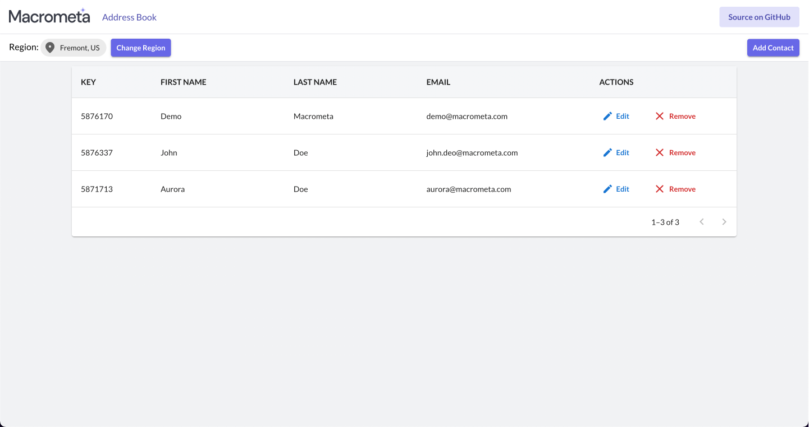

# Global Address Book

### Live Demo: https://macrometacorp.github.io/tutorial-addressbook-streams/

Demo to show a Real-time adrress book!

## Setup

| **Federation**                                        | **Email**          | **Passsword** |
| ----------------------------------------------------- | ------------------ | ------------- |
| [Global Data Network](https://gdn.paas.macrometa.io/) | demo@macrometa.com | `xxxxxxxx`    |

## Overview

**Dashboard:**



### Macrometa Account setup

1. Create the following collections with stream in your Macrometa account:

```
addresses(global)
```

2. On the development machine, run the following commands in a console:

```
1. git clone git@github.com:Macrometacorp/tutorial-addressbook-streams.git
2. cd tutorial-addressbook-streams
3. git fetch
4. npm install
5. npm run start
```

3. Rename `.env.sample` to `.env` and update the `REACT_APP_GDN_URL` with `https://gdn.paas.macrometa.io`

4. Once you have the app running, you will be presented with a page to log in with your Macrometa account. Add your Macrometa account email and password and the user will then be asked to select one region in the GUI.
 
5. Deploy on GH Pages:

```
npm run deploy
```
